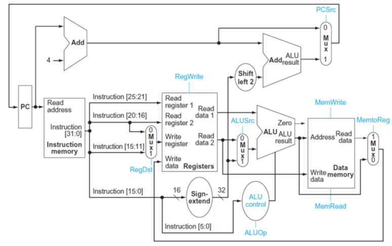
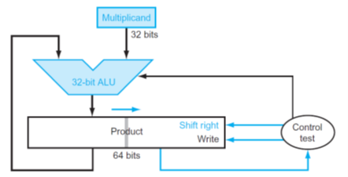
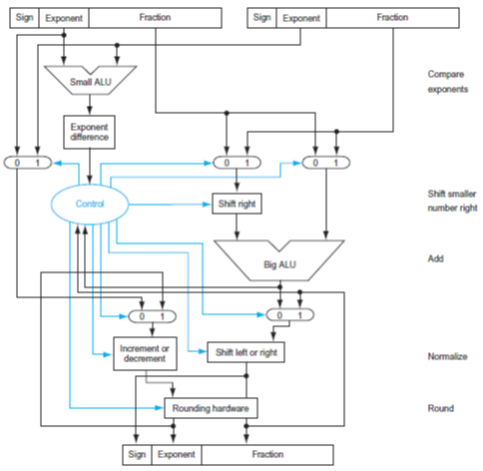
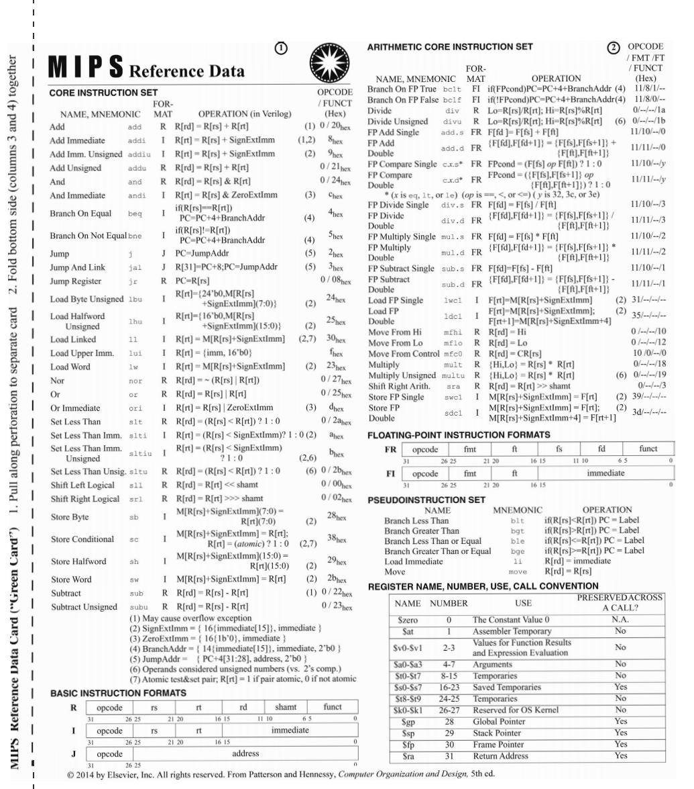

<!--
 * @Github: https://github.com/Certseeds/CS202_Computer_Organization
 * @Organization: SUSTech
 * @Author: nanoseeds
 * @Date: 2021-04-16 22:31:15
 * @LastEditors: nanoseeds
 * @LastEditTime: 2021-04-17 00:01:51
 * @License: CC-BY-NC-SA_V4_0 or any later version 
 -->

# CS202 Computer Organization

## Spring 2020

### **Midterm Examination**

**Date: April 28, 2020**  
**Time: 16:00 – 18:00**

**Student ID:\_\_\_\_\_\_**
**Name: \_\_\_\_\_\_**

## 1 (30 points) Simple Choice. Please select one best answer from A B C and D

1. In the following items, ­­­­­­­\_\_\_\_\_\_\_ can reduce the program execution time.

  i) Increase the clock rate

  ii) improve the datapath

  iii) optimize thecompiler

| Choice |          |
| :----- | -------: |
| A      |     i,ii |
| B      |    i,iii |
| C      |   ii,iii |
| D      | i,ii,iii |

2. Computer M1 and M2 has the same ISA, their clock rate is 1.5GHz and 1.2GHz respectively. The CPI of running a program P on M1 and M2 is 2 and 1 respectively, then, the ratio of the execution time of running P on M1 and M2 is \_\_\_\_\_\_\_.

| Choice |       |
| :----- | ----: |
| A      |   0.4 |
| B      | 0.625 |
| C      |   1.6 |
| D      |   2.5 |

3. Assuming that there are four integers, each of them is in an 8-bit register in format of 2’s complement. r1=0xFE, r2=0xF2, r3=0x90, r4=0xF8. If the result is also in an 8-bit register, the operation of \_\_\_\_\_\_ will generate overflow.

| Choice |         |
| :----- | ------: |
| A      | r1 x r2 |
| B      | r2 x r3 |
| C      | r1 x r4 |
| D      | r2 x r4 |

4. x and y are two float numbers stored in 32-bit registers $f1$ and $f2$ respectively, (f1)=0xCC900010, (f2)=0xB0C00100, then x and y follows \_\_\_\_\_\_\_.

| Choice |                             |
| :----- | --------------------------: |
| A      |      $x<y, sign(x)=sign(y)$ |
| B      | $x<y, sign(x) \neq sign(y)$ |
| C      |      $x<y, sign(x)=sign(y)$ |
| D      | $x>y, sign(x) \neq sign(y)$ |

5. Assume that in a pipeline CPU, each instruction can be divided into three stages: IF ID EXE, each stage cost $\Delta t$ execution time. If the CPU employ 4-multiple issue pipeline, assume that 12 instructions are consecutively executed without any stalls, then the total execution time for them is \_\_\_\_\_.

| Choice |              |
| :----- | -----------: |
| A      | $3 \Delta t$ |
| B      | $5 \Delta t$ |
| C      | $7 \Delta t$ |
| D      | $9 \Delta t$ |

6. For a 4-stage pipeline CPU, with a 1.03GHz clock rate, each stage cost one clock cycle. 100 instructions are consecutively executed in the pipeline without any stalls, calculate the throughput of this CPU for running the above 100 instructions.

| Choice |                                        |
| :----- | -------------------------------------: |
| A      | $0.25 \ast 10^{9}$ instructions/second |
| B      |  $0.97 \ast 10^{9}$instructions/second |
| C      |  $1.0 \ast 10^{9}$ instructions/second |
| D      | $1.03 \ast 10^{9}$ instructions/second |

7. What can be stored in the register module of CPU?

| Choice |                                                                 |
| :----- | --------------------------------------------------------------: |
| A      | Only data can be stored in it, address can not be stored in it. |
| B      |                      Only data and address can be stored in it. |
| C      |                   Neither data nor address can be stored in it. |
| D      |         Data, address and instructions can all be stored in it. |



8. Sign extension is not needed in \_\_\_\_\_\_\_ instruction.

| Choice |      |
| :----- | ---: |
| A      |  sll |
| B      | addi |
| C      |  bne |
| D      |   lw |

9. Which of the following statement is not correct?

| Choice |                      |
| :----- | -------------------: |
| A      |  RegWrite is 1 in lw |
| B      |  ALUSrc is 1 in addi |
| C      | MemtoReg is 1 in add |
| D      |  MemWrite is 1 in sw |

10. To exploit instruction-level parallelism, which of the following
  approaches are not hardware-based approach?

| Choice |                            |
| :----- | -------------------------: |
| A      |                superscalar |
| B      | very long instruction word |
| C      |     dynamic multiple issue |
| D      |             reorder buffer |

## 2 (10 points)

You are designing an embedded processor. Based on an analysis of the software that it will run, you find the following mix of instructions, which have the specified execution time in your current design:

| Instructions | Percentage | Time     |
| ------------ | ---------- | -------- |
| load         | 12%        | 4 cycles |
| store        | 10%        | 8 cycles |
| branch       | 18%        | 2 cycles |
| add          | 60%        | 1 cycles |

1. (2 points) What is the CPI of your processor on this mix of instructions?

2. (2 points) If the clock rate of your processor is 40MHz, and the total number of instructions of the software is 5000. Calculate the execution time for the software to run in your processor.

3. (2 points) Based on your design analysis, you figure out that you can halve the cycle latency of any single category of instruction, although you will need to increase the cycle time by 10%. Should you make this change, and if so, what category of instruction should you speed up?

4. (2 points) What is the CPI of your new design?

5. (2 points) What is the speedup of your revised design over the
original one?

## 3. (8 points) At the end of executing the following MIPS instruction sequence, specify the contents of the following registers

``` mipsasm
  addi $s0, $zero, 7
  addi $v0, $zero, -3
  add $s1, $s0, $v0
  beq $s1, $v0, Skip
  srl $s2, $s1, 1
Skip:
  or $v0, $v0, $s2
```

Answer:

| Register | Value |
| :------- | ----: |
| $\$s0$   |     ? |
| $\$v0$   |     ? |
| $\$s1$   |     ? |
| $\$s2$   |     ? |

## 4

### a (8 points)

Calculate the product of 6 × 7 using the hardware described below, with the multiplicand equals to 6. Both multiplicand and multiplier are unsigned 4-bit integers. Please show the contents of each register on each step and the final result.



PS: replace 32 by 4, 64 by 8 in graph please.

Answer:

| Iteration | Multiplicand | Product |
| --------- | ------------ | ------- |
| 0         | ?            | ?       |
| 1         | ?            | ?       |
| ...       | ?            | ?       |

### \(b) (9 points)

Consider a 16-bit floating-point number format as follows, the left most bit is still the sign bit, the exponent is 5 bits wide and has a bias of 16 (the real exponent equals to the number stored in exponent part minus 16), and the fraction part is 10 bits long. A hidden 1 in the fraction part is assumed. Write down the bit pattern to represent -0.828125 in decimal. Calculate the range and relative precision of this 16-bit floating point format, assuming the all-one bit stream and all-zero bit stream in the exponent domain are reserved.

### \(c) (7 points)

In the following adder for floating points, assume the left floating-point number is -0.125, the right floating-point number is 2.375.

+ 1st, write down the control input for mux1, mux2 and mux3. Please show the calculation procedure explaining how you get the results.
+ 2nd, In the normalize stage, should the operation in the module "Increment or decrement" be increment or decrement? Should the operation in the module "shift left or right" be left or right? Why?



PS:左上侧(0 1)为mux1,上侧为mux2,右上侧为mux3

## 5

For the C code: `for (int i=0; i<N; i++) {result = result + data[i]}`, assume that the values of result, i, and N are in registers $\$s1$, $\$s2$ and $\$s6$ respectively. Also, assume that register $\$s3$ holds the base address of the array data. The code is stored in the instruction memory started from address 0x08048100. The compiled MIPS code is as follows:

 | Instruction | Address    | MIPS code                   | Addressing mode |
 | ----------- | ---------- | --------------------------- | --------------- |
 | 1           | 0x08048100 | loop: sll $\$s4$, $\$s2$, 2 |                 |
 | 2           | 0x08048104 | add $\$s4$, $\$s4$, $\$s3$  |                 |
 | 3           | 0x08048108 | lw $\$s5$, 0(s4)            |                 |
 | 4           | 0x0804810C | add $\$s1$, $\$s1$, $\$s5$  |                 |
 | 5           | 0x08048110 | addi $\$s2$, $\$s2$, 1      |                 |
 | 6           | 0x08048114 | bne $\$s2$, s6, loop        |                 |

Answer the following questions, show the steps if necessary.

1. (6 points) Please give the addressing mode for each instruction.

2. (6 points) Please give the 32-bit machine code for instruction 5 "addi $\$s2$, $\$s2$, 1". and instruction 6 "bne $\$s2$, s6, loop".

3. (2 points) How many bits does each element of the array `data[i]` occupies in the memory?

4. (6 points) Assume that the CPU works in a 5-stage pipeline IF-ID-EXE-MEM-WB without forwarding, which instructions will be stalled because of data hazards? Which instructions will be stalled because of control hazards?

5. (6 points) If forwarding is implemented in the hardware, the stalls before which instructions can be eliminated? The stalls before which instructions can be reduced? Can you use instruction reordering to further reduce the stalls? How?

6. (2 points) To reduce the stalls caused by control hazards, what method can be used?

Appendix:
